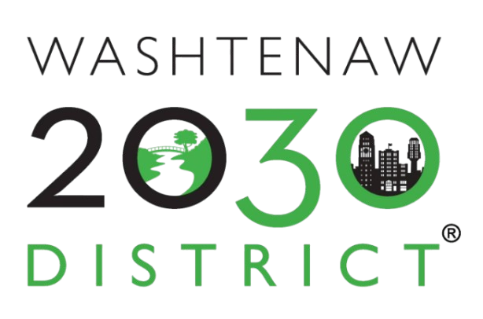
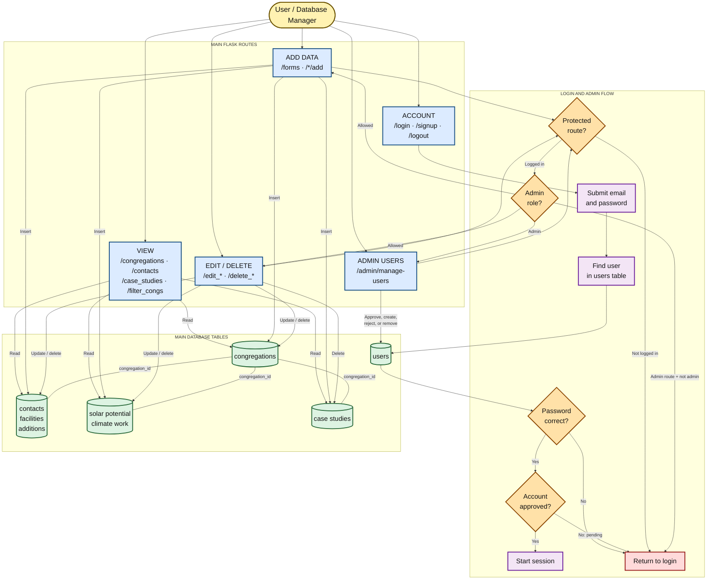
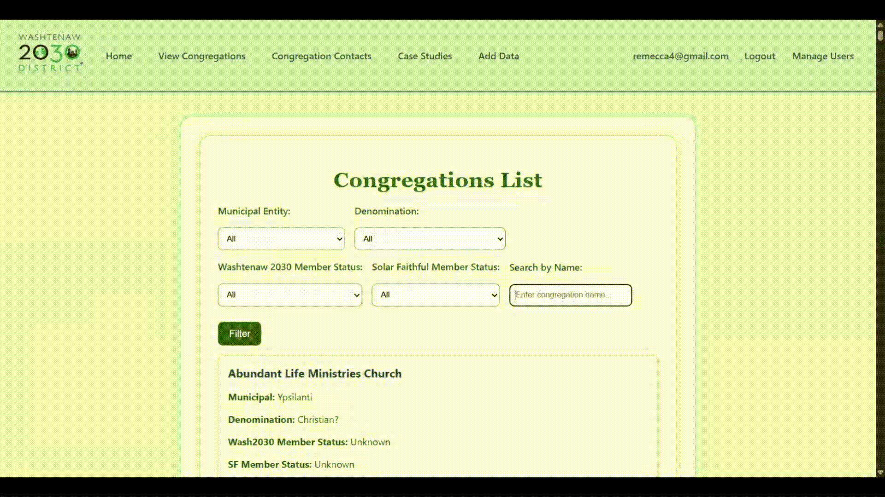
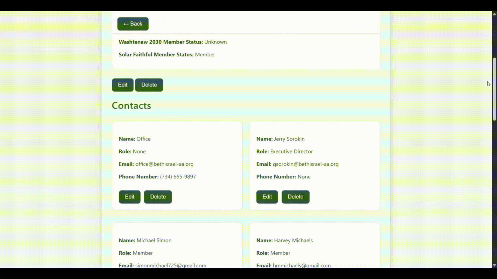
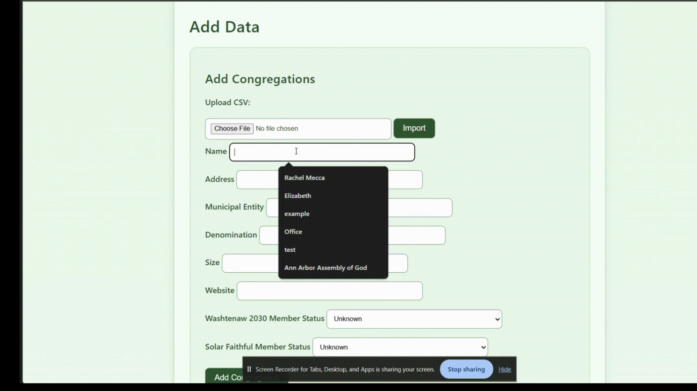
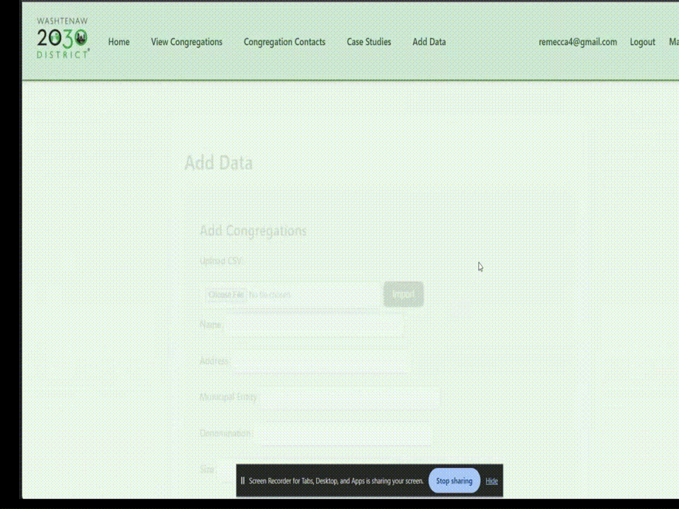

<div align="center">



# Houses of Worship Database Web Application

**A full-stack web application for managing and exploring Houses of Worship data.**

[Features](#features) •
[Technologies](#technologies-used) •
[Architecture](#system-architecture) •
[Installation](#installation) •
[Usage](#example-usage) •
[Customization](#customizing-for-your-own-how-database) •
[FAQ](#frequently-asked-questions)

</div>

> [!NOTE]
> This project was designed for Washtenaw County, Michigan. Other organizations can adapt the code to create their own Houses of Worship databases for research, sustainability programs, or community outreach.

## Overview

This application allows organizations to collect, store, edit, and explore information about congregations through an easy-to-use web interface.

The system includes:

- Congregation, contact, and facility records
- Solar-potential and climate-work tracking
- Case studies with cloud-hosted images
- A searchable contact directory
- Comma-separated values (CSV) bulk imports
- User authentication and role-based access control

## Table of Contents

- [Features](#features)
  - [Congregation Management](#congregation-management)
  - [Case Studies](#case-studies)
  - [Contact Directory](#contact-directory)
  - [CSV Bulk Import](#csv-bulk-import)
  - [Authentication System](#authentication-system)
- [Technologies Used](#technologies-used)
- [System Architecture](#system-architecture)
- [Installation](#installation)
- [Running the Application](#running-the-application)
- [Creating the First Admin](#creating-the-first-admin)
- [Example Usage](#example-usage)
  - [Viewing and Editing Congregation Data](#viewing-and-editing-congregation-data)
  - [Adding a New Congregation and Contact](#adding-a-new-congregation-and-contact)
- [Customizing for Your Own HOW Database](#customizing-for-your-own-how-database)
- [Frequently Asked Questions](#frequently-asked-questions)
- [Author](#author)

## Features

### Congregation Management

Users can add, edit, view, and delete detailed congregation information, including:

- Name
- Address
- Municipal entity
- Denomination
- Contact information
- Website
- Solar Faithful membership status

The application stores building characteristics such as:

- Facility size
- Building age
- Heating, ventilation, and air conditioning (HVAC) systems
- Estimated electric bill
- Building additions

It also tracks sustainability initiatives, including:

- Solar potential
- Climate work
- Case studies

### Case Studies

Case studies can be created for congregations. Images can be uploaded and displayed using cloud image hosting.


### Contact Directory

A searchable directory allows users to filter congregations by:

- Municipal entity
- Denomination
- Solar Faithful membership status

### CSV Bulk Import

Large datasets can be uploaded as CSV files and automatically inserted into the database.

Supported imports include:

- Congregations
- Facilities
- Building additions
- Solar potential
- Climate work

View the required formats in the [CSV import templates](https://docs.google.com/spreadsheets/d/13jgp2n4W6qgdXEbd4O1hvG1iYwRxBdnyfIwHcsIU0Mc/edit?usp=sharing).

CSV imports run as background threads so the website remains responsive during large uploads.

### Authentication System

The site includes a secure login system with:

- Password hashing
- Role-based access control
- Administrator approval for new users

#### User Roles

| Role | Permissions |
| --- | --- |
| **Admin** | Manage users, approve registrations, and manage database records |
| **User** | Add and edit congregation data |

## Technologies Used

### Backend

- Python
- Flask
- PostgreSQL

### Frontend

- HTML
- CSS
- Jinja templates

### Cloud Services

- [Render](https://render.com/) — web application hosting
- [Aiven](https://aiven.io/) — PostgreSQL database hosting
- [Cloudinary](https://cloudinary.com/) — image hosting for case studies

## System Architecture


## Installation

### 1. Clone the Repository

```bash
git clone git@github.com:remecca4/Washtenaw2030_HOW_DB.git
cd Washtenaw2030_HOW_DB
```


### 2. Create a Virtual Environment

```bash
python -m venv .venv
```

Activate the virtual environment.

#### macOS or Linux

```bash
source .venv/bin/activate
```

#### Windows PowerShell

```powershell
.venv\Scripts\Activate.ps1
```

### 3. Install Dependencies

```bash
pip install -r requirements.txt
```

### 4. Set Environment Variables

Create a `.env` file or configure the following variables in your deployment environment:

```dotenv
SECRET_KEY=your_secret_key
CLOUDINARY_CLOUD_NAME=your_cloud_name
CLOUDINARY_API_KEY=your_api_key
CLOUDINARY_API_SECRET=your_api_secret
DATABASE_URL=your_postgresql_connection_string
```

## Running the Application

Start the Flask server:

```bash
python app.py
```

Then open the application in your browser:

```text
http://localhost:5000
```

## Creating the First Admin

If no administrator exists in the database, manually insert a user with the role `admin` into the `Users` table.

Administrators can:

- Approve new users
- Reject signup requests
- Create new users
- Remove users
- Manage database records

> [!IMPORTANT]
> Store only a properly hashed password. Do not insert a plain-text password into the database.

## Example Usage

### Viewing Congregation Data

<p align="center">
  
</p>

### Editing Congregation Data

<p align="center">
  
</p>

### Adding a New Congregation


<p align="center">
  
</p>

### Adding a New Contact

<p align="center">
  
</p>

## Customizing for Your Own HOW Database

To adapt this system for another organization:

1. Update the database schema to match your data requirements.
2. Modify the CSV parsing logic in `parse_csv.py`.
3. Adjust form fields in `templates/forms.html`.
4. Adjust the congregation view in `templates/congregations.html`.
5. Update the branding and user interface.
6. Deploy your instance using Render or another hosting platform.

Because the database logic is centralized in `db_manager.py`, most customization can be completed without modifying the main application logic.

## Frequently Asked Questions

### Can I add multiple administrators to the website?

Yes. You can add as many administrators as needed.

### Do I have to use Aiven and Render to deploy the application?

No. You can use any compatible deployment method and PostgreSQL hosting provider.

### Can I change data after entering it through the website?

Yes. Authorized users can edit or delete data entered through the website.

## Author

**Rachel Mecca**

Computer Science  
University of Michigan